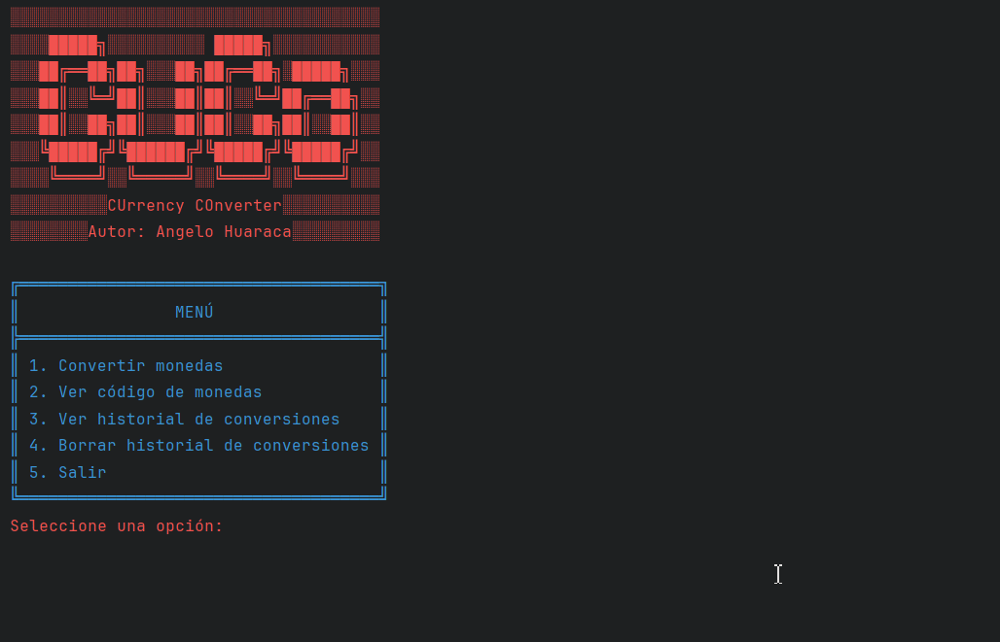
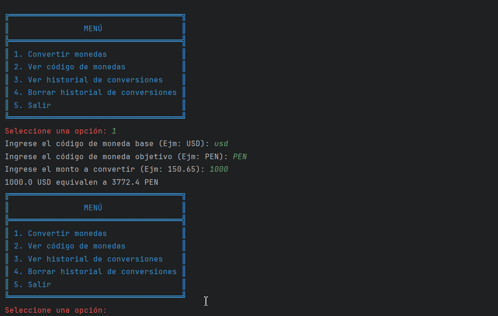
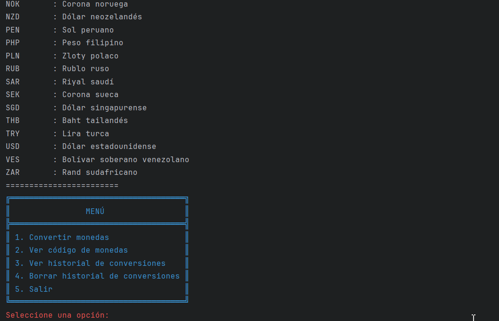
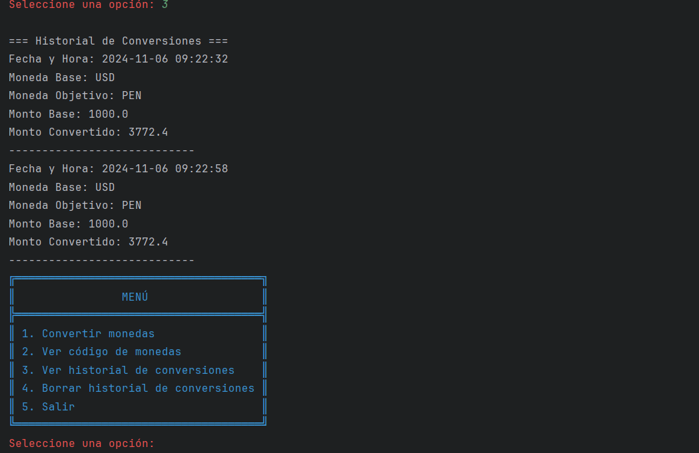
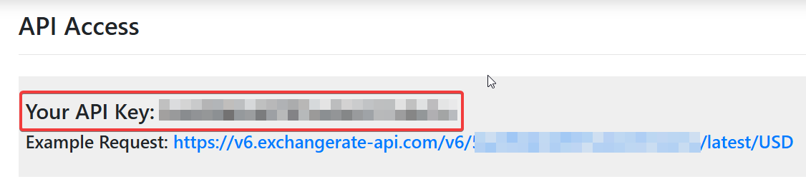

# Conversor de Monedas
# CuCo (Currency Converter) 💰


CuCo es un programa de consola diseñado para realizar conversiones de monedas de manera rápida y eficiente. Este software permite convertir montos entre diferentes divisas, proporcionando resultados precisos y actualizados. Utiliza las tasas de conversión actuales para asegurar la exactitud en cada transacción.

## Características Principales

### Función Convertir Monedas 💱



### Función Ver Códigos de Monedas 🔍



### Función Ver Historial de Conversiones 💹



### Función Borrar Historial de Conversiones 🗑



## Instalación 🔧

Si quiere tener este proyecto y desplegarlo localmente repita los siguientes pasos:

### Pre-requisitos 📋

- Instalar Git
- Instalar IntelliJ (Recomendado)
- Registrarse en https://www.exchangerate-api.com/


- Loguearse y obtener API Key


### Ejecución 💻

#### Clonar repositorio

```bash
git clone https://github.com/ahuaracab/CuCo
```

#### Abrir el proyecto desde IntelliJ

```bash
Open -> busca la carpeta donde clonaste el repositorio -> selecciona CuCo
```

#### Variable de entorno

```bash
Duplicar el archivo config.properties.copy y renombrarlo como config.properties
En el archivo config.properties colocar la API Key obtenida anteriormente
```
con
```bash
API_KEY=pega_tu_api_key
```

#### Ejecutar archivo Main

```bash
Ir al archivo Main y presionar Shift + F10
o
Click derecho en archivo Main y seleccionar Run 'Main.main()' 
```


## Autores ✒️

- **Angelo Huaraca** - _Back Developer_ - [ahuaracab](https://github.com/ahuaracab)

## Licencia 📄

Este proyecto está bajo la Licencia MIT - mire el archivo [LICENSE](LICENSE) para más detalles

## Expresiones de Gratitud 🎁

Quiero agradecer a Alura y Oracle por capacitarme en su programa ONE, sin ellos no hubiera podido tener las herramientas para desarrollar este desafío 🎓

---

⌨️ con ❤️ por [Angelo Huaraca](https://github.com/ahuaracab) 😊